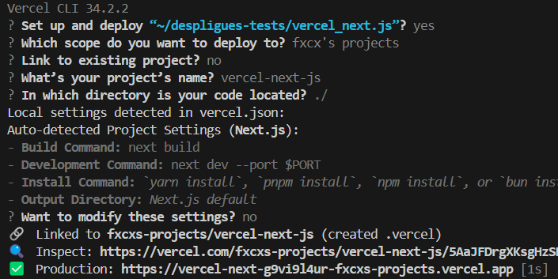

## Getting Started

- pasos de la creacion del proyecto desde cero

- bun create next-app *nombre del proyecto*

intalar paquetes atravez bun.lock maneja nuestras dependencias, ese seria nuestro administrador de paquetes

- Para instalar los paquetes que tiene nustro administrador de paquetes **bun install** similar a lo que hariamos en npm install

- Como agregar nuestros paquetes **bun add** y -D para paquetes de desarrollo 

- Para bibliotecas externas e desarrollo usarias **bunx**

## Despligue

- bun add -g vercel

configuramos el despligues
- bunx vercel

a travez de un proyecto existente en github hacemos el despligue teniendo en cuenta que este proyecto no exista ya en vercel en vercel.
para hacer actualizaciones solo tendrias que hacer un push de nuetros cambios al repositorio y automaticamente se veria reflejado en el hosting de vercel.

. A partir de ahora usaremos una rama de desarrollo para tener diferentes entornos